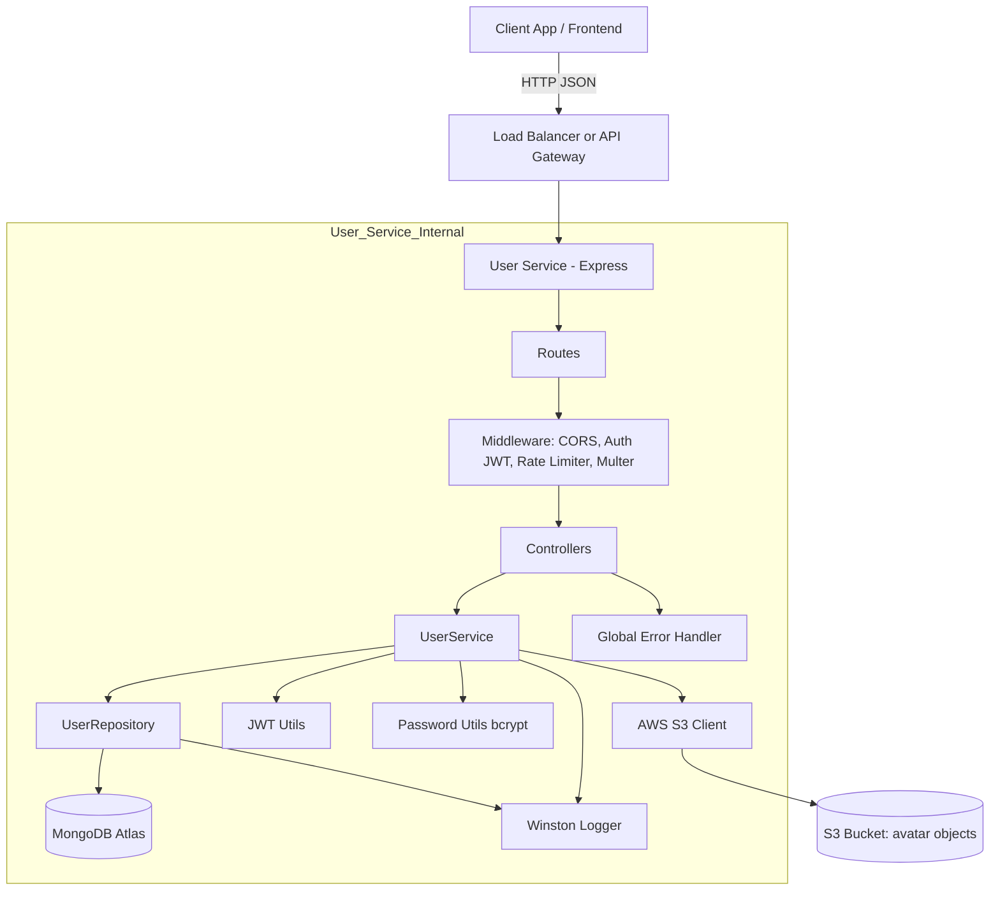
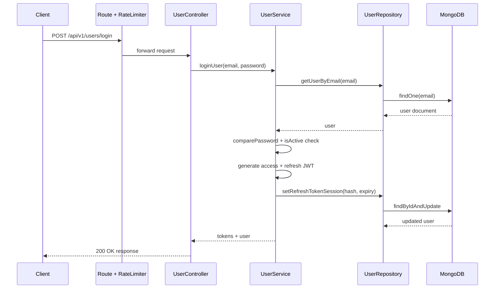

# User Service System Architecture

## 1. Purpose
The User Service is responsible for identity and account features in the DB-Engine system.

It provides:
- User registration
- User login and JWT-based authentication
- Access token refresh
- Profile management
- Password change
- Avatar upload to AWS S3
- Logout (refresh session revocation)

This service follows a layered architecture:
- API layer (routes + controllers)
- Business layer (services)
- Data access layer (repositories)
- Persistence layer (MongoDB via Mongoose)

## 2. High-Level Architecture

## 3. Runtime Building Blocks

### 3.1 API and Routing
- Entrypoint: `src/index.js`
- Base API prefix: `/api`
- Version prefix: `/v1`
- User routes prefix: `/users`
- Health endpoint: `GET /ping`

Final route shape:
- `/api/v1/users/...`

### 3.2 Layer Responsibilities
- Routes: Define endpoint paths and middleware chain.
- Controllers: Validate basic request fields, map request to service calls, shape HTTP responses.
- Services: Core business rules (auth, token lifecycle, profile update, avatar upload).
- Repository: All MongoDB reads/writes for User documents.
- Model: User schema, validations, password hashing hook, JSON sanitization.

### 3.3 External Integrations
- MongoDB Atlas:
  - Stores user accounts and refresh token session metadata.
- AWS S3:
  - Stores avatar files.
- JWT:
  - Stateless access and refresh token issuance/verification.

## 4. Code-Level Component Map

| Component | File(s) | Responsibility |
|---|---|---|
| Server boot | `src/index.js` | Express app setup, middleware, route mounting, graceful shutdown |
| API router | `src/routes/index.js` | Mount versioned routes |
| V1 router | `src/routes/v1/index.js` | Mount user routes |
| User routes | `src/routes/v1/user.routes.js` | Endpoint definitions and middleware wiring |
| Controller | `src/controllers/user.controller.js` | HTTP input/output handling |
| Service | `src/services/user.service.js` | Business logic and orchestration |
| Repository | `src/repositories/user.repository.js` | Persistence operations with Mongoose |
| User model | `src/models/user.model.js` | Schema, indexes, hooks, response shaping |
| Auth middleware | `src/middleware/auth.middleware.js` | Bearer token verification |
| Rate limiter | `src/middleware/rateLimit.middleware.js` | In-memory throttling |
| JWT utils | `src/utils/jwt.utils.js` | Token issue/verify |
| Password utils | `src/utils/password.utils.js` | Hash/compare/strength checks |
| Error handler | `src/utils/errorHandler.js` | Centralized exception to HTTP response mapping |
| DB config | `src/config/db.config.js` | Singleton connect/disconnect lifecycle |
| AWS config | `src/config/aws.config.js` | S3 client wiring |
| Logger config | `src/config/logger.config.js` | Console + file logging |

## 5. API Endpoints

| Endpoint | Method | Auth | Notes |
|---|---|---|---|
| `/api/v1/users/register` | POST | No | Rate-limited auth endpoint |
| `/api/v1/users/login` | POST | No | Returns access + refresh tokens |
| `/api/v1/users/refresh` | POST | No | Rotates and returns new tokens |
| `/api/v1/users/profile` | GET | Yes | Reads current user profile |
| `/api/v1/users/profile` | PUT | Yes | Updates firstName/lastName |
| `/api/v1/users/password` | PUT | Yes | Validates old + new password |
| `/api/v1/users/avatar` | POST | Yes | Multipart upload, stores in S3 |
| `/api/v1/users/logout` | POST | Yes | Clears refresh session |
| `/ping` | GET | No | Service health probe |

## 6. Request Processing Flow

### 6.1 Authentication Flow (Login)

### 6.2 Protected Route Flow
1. Client sends `Authorization: Bearer <access_token>`.
2. `auth.middleware` verifies token signature and expiry.
3. Decoded payload is attached to `req.user`.
4. Controller calls service using `req.user.id`.
5. Service reads/updates data through repository.
6. Response returns sanitized user object (`password` removed by model `toJSON`).

### 6.3 Avatar Upload Flow
1. `multer` stores file temporarily in OS temp directory.
2. Controller validates MIME type (`jpeg`, `png`, `webp`).
3. Service uploads file stream to S3 bucket via `PutObjectCommand`.
4. Service saves generated `avatarUrl` in MongoDB.
5. Temp file is deleted in `finally` block.

## 7. Data Architecture

### 7.1 User Collection Schema (Key Fields)

| Field | Type | Constraints / Behavior |
|---|---|---|
| `username` | String | required, unique, 3..30, alphanumeric + `_` |
| `email` | String | required, unique, lowercase, regex validation |
| `password` | String | required, min 8, hashed in pre-save hook |
| `firstName` | String | optional, max 50 |
| `lastName` | String | optional, max 50 |
| `avatarUrl` | String | optional, S3 object URL |
| `isActive` | Boolean | soft-active flag |
| `refreshTokenHash` | String | SHA-256 hash of latest refresh token |
| `refreshTokenExpiresAt` | Date | refresh session expiry time |
| `createdAt/updatedAt` | Date | automatic timestamps |

Index:
- `email` index exists for lookup efficiency.

### 7.2 Token Session Model
- Access token: short-lived JWT, used for API authorization.
- Refresh token: longer-lived JWT, used to rotate session.
- Persisted state: only hash + expiry of current refresh token in User doc.
- Implication: one active refresh session per user record (new login/refresh overwrites previous session).

## 8. Security Architecture

### 8.1 Authentication and Authorization
- Bearer token authentication for protected endpoints.
- Access token validated on each protected request.
- Refresh token validated and checked against stored hash + expiry.

### 8.2 Credential Safety
- Password hashing with bcrypt (salt rounds: 10).
- Password never returned in API responses (`toJSON` removes it).
- Refresh token stored as SHA-256 hash, not as plain token.

### 8.3 Abuse Protection
- In-memory rate limiter for auth endpoints:
  - Window: 15 minutes
  - Max: 10 requests per IP
- Suitable for single-instance deployments only.

### 8.4 Input and Content Controls
- Required field checks in controller.
- Password strength checks in service.
- Mongoose schema-level constraints and validation.
- Avatar file size limit: 1MB.
- Avatar MIME allow-list: `image/jpeg`, `image/png`, `image/webp`.

### 8.5 CORS
- CORS enabled with:
  - Dynamic `origin: true`
  - Methods: `GET`, `PUT`, `POST`, `DELETE`
  - Allowed headers: `Content-Type`, `Authorization`

## 9. Error Handling and Observability

### 9.1 Error Strategy
- Domain errors inherit `BaseError` and include HTTP status code.
- Global error middleware maps known failures to consistent JSON responses.
- Special handling for:
  - Mongoose validation errors
  - Duplicate key errors (`11000`)
  - JWT invalid/expired errors
- Unknown errors return `500 Internal Server Error`.

### 9.2 Logging
- Winston logger configured with:
  - Console transport
  - `app.log` file
  - `error.log` file for error level
- Service and repository layers log major events and failures.

## 10. Configuration and Environment Variables

| Variable | Required | Default | Purpose |
|---|---|---|---|
| `PORT` | No | `3001` | HTTP server port |
| `ATLAS_DB_URL` | Yes | - | MongoDB connection string |
| `NODE_ENV` | No | `development` | Runtime environment |
| `JWT_SECRET` | Yes | - | Access token signing key |
| `JWT_EXPIRES_IN` | No | `24h` | Access token TTL |
| `JWT_REFRESH_SECRET` | Yes | - | Refresh token signing key |
| `JWT_REFRESH_EXPIRES_IN` | No | `7d` | Refresh token TTL |
| `AWS_REGION` | For avatar upload | - | S3 region |
| `AWS_ACCESS_KEY_ID` | For avatar upload | - | AWS credential |
| `AWS_SECRET_ACCESS_KEY` | For avatar upload | - | AWS credential |
| `S3_BUCKET_NAME` | For avatar upload | - | Bucket target for avatars |

## 11. Deployment View

### 11.1 Container
- Base image: `node:20-alpine`
- Install command: `npm ci --omit=dev`
- Entrypoint: `npm start`
- Dockerfile exposes: `8181`

### 11.2 Startup and Shutdown
- Service starts only after successful DB connection.
- On `SIGINT`/`SIGTERM`:
  - Mongoose disconnect is awaited
  - Process exits cleanly

### 11.3 Operational Note
- App listens on `PORT` (default `3001`), while Dockerfile exposes `8181`.
- In containerized deployment, set `PORT=8181` or change Dockerfile to expose the same port used by runtime.

## 12. Scalability and Reliability Notes

Current design is clean and practical for a small-to-medium service, with two main scale considerations:
- Rate limiter uses in-memory `Map`:
  - Per-instance counters only
  - Use Redis-backed limiter for multi-instance deployments
- Refresh token session stored as single hash field on user:
  - Supports one active refresh session per user record
  - For multi-device sessions, introduce a separate session collection/table

Additional production recommendations:
- Add request validation middleware (e.g., zod schemas per endpoint).
- Add request ID and structured correlation logging.
- Add health checks for DB readiness/liveness split.
- Add API and integration tests for token rotation and avatar upload paths.

## 13. Summary
The User Service is a layered Express + MongoDB authentication microservice with JWT session management and optional avatar storage in S3. Its architecture is simple to reason about, easy to extend, and already includes key production patterns (centralized errors, graceful shutdown, token rotation, and logging), while leaving clear upgrade paths for distributed rate limiting and multi-device session management.
